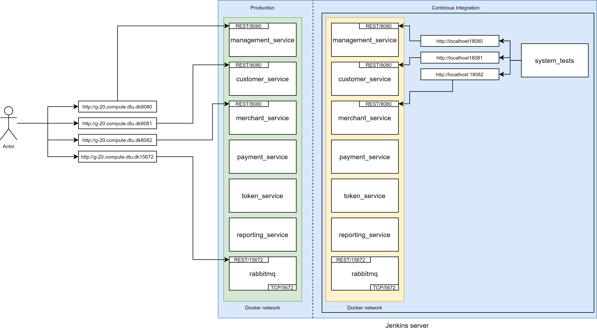
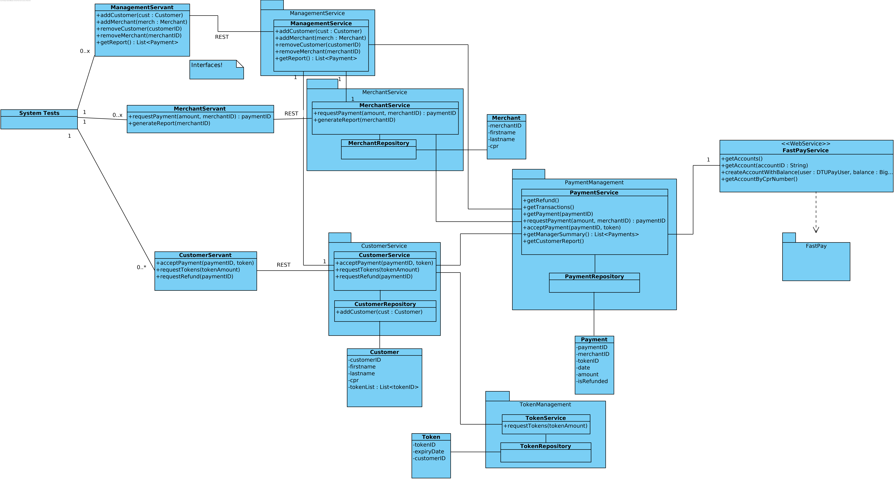

# Webservices Project
[](http://g-20.compute.dtu.dk:8282/job/DTUPay-CI_CD/lastBuild/)

## Participants
* Björn Wilting (s184214)
* Mikkel Rosenfeldt Anderson (s184230)
* Laura Sønderskov Hansen (s184234)
* Oliver Orla Nielsen (s164917)
* Benjamin Eriksen (s153724)
* Rubatharisan Thirumathyam (s205904)

## Web-service (debug) endpoints
| Name                 | Production                                                                                               |
|----------------------|----------------------------------------------------------------------------------------------------------|
| Management Service   | [http://g-20.compute.dtu.dk:8080/management_service](http://g-20.compute.dtu.dk:8080/management_service) |
| Customer Service     | [http://g-20.compute.dtu.dk:8081/customer_service](http://g-20.compute.dtu.dk:8081/customer_service)     |
| Merchant Service     | [http://g-20.compute.dtu.dk:8082/merchant_service](http://g-20.compute.dtu.dk:8082/merchant_service)     |

## Useful links
| Name                 | Link                                                                                                     |
|----------------------|----------------------------------------------------------------------------------------------------------|
| Rabbit MQ Management | [http://g-20.compute.dtu.dk:15672](http://g-20.compute.dtu.dk:15672)                                     |
| Jenkins.             | [http://g-20.compute.dtu.dk:8282/](http://g-20.compute.dtu.dk:8282/)                                     |

## Implemented services
| Name                 | Status                                                                                                     |
|----------------------|----------------------------------------------------------------------------------------------------------|
| management_service   | Implemented                                                                                              |
| merchant_service     | Implemented                                                                                             |
| customer_service     | Implemented                                                                                              |
| token_service        | Drafting                                                                                              |
| payment_service      | In progress                                                                                              |
| reporting_service    | Drafting                                                                                                 |

## How to run
Build and test all services
```
bash scripts/build_and_test_all.sh
```

Build and test a specific service
```
bash <service_name>/build_and_test.sh
```

Start all services and run integration test
```
bash scripts/run_integration.sh
```

## Message Queue logic
```
message:
{
  "event": "<event>",
  "status": 200,
  "statusMessage": "<NONE>",
  "requestId": <UUID>,
  "messageId": <UUID>,
  "payload": {
    "customerId": 1234, # example
    "amount": 5 # example
  },
  "callback": {
    "service": "<service_name>",
    "event": "<event>"
  }
}

RabbitMQ.sendMessage("<service_name>", message, callback = null);
```
## Message response <-> requests
https://gist.github.com/Rubatharisan/64c3737145e8ff2805deeed104808a00 (draft)

## Server Ports



## UML

